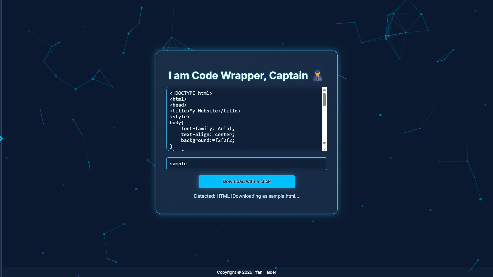
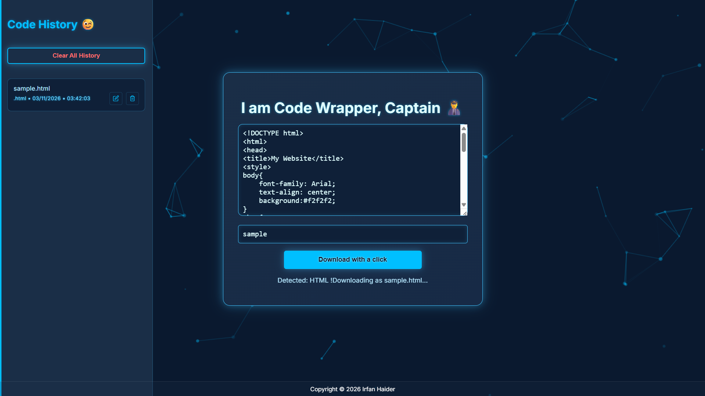

# 💻 Code Wrapper By Irfan 

A zero-setup, single-file HTML tool that allows you to paste any code snippet and download it instantly with the correct filename and extension. It works entirely offline in your browser. Specially helpful for vibe coders for ai assisted coding, and those who want to save text instantly in txt file. just paste text/code and hit download. 

## ✨ Features

* **Modern and Interactive GUI:** Beautiful asthetic vibe so it wont feel static and boring. 
* **Offline First:** Works 100% in the browser and requires no internet connection after the initial load.
* **Auto-Detection:** Automatically detects over 15 computer languages (HTML, Python, JS, Java, C++ etc.)
* **Download History:** Saves your recent code snippets to a local history panel for quick access and re-downloads.
* **Simple Interface:** Paste code, enter a filename, and click "Download with a click."
* **History panel:** Saves history on computer brower with date and time stamps for re-downloads and re-editing. 

## 🖼️ Preview

## 🚀 How to Use

1.  Download the `index.html` file and open it in any modern web browser. 
2.  Visit through website link directly. 

* **live on Github** [Click here! ](https://irfanh-dev.github.io/code-wrapper/)

* 💡 Tip: For regular usage, add the file to your browser bookmarks for instant access. 
* 💡 Tip: For accurate results, give it name with extension (e.g.  `filename.html` ) 
* 💡 Tip: Enter key work as download button when select filename. 
* 💡 Tip: Default extension is .txt for unknown or no extension text/code. 

## ⚙️ Development & Technology

This tool is a single-file application using:

* **HTML & CSS:** For structure and the attractive, neon-styled interface.
* **JavaScript:** Handles all logic, including code detection, local storage for history, and the particle background effect.
* **Inter Font:** Used for clean typography.

## 📜 License

* This project is open source and distributed under the **MIT License**.

---

Made with 💙 by Irfan ([@irfanh-dev](https://github.com/irfanh-dev)). Assisted with Ai  || 🚀 Stay connected for More Awesome Future upcoming projects.
